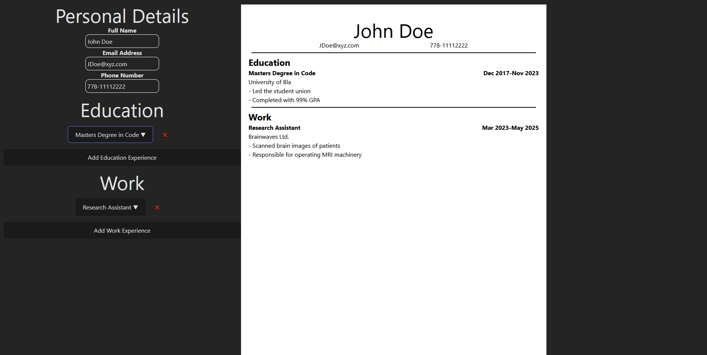

This is a learning project to familiarize myself with some of the basics of react. It serves as a client-sided application that creates a resume for the user based on their input.

Check out the live demo: https://r-lok.github.io/react-resume-app/

